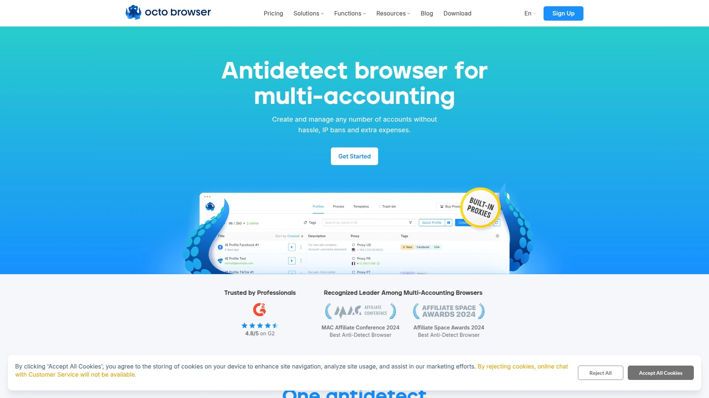
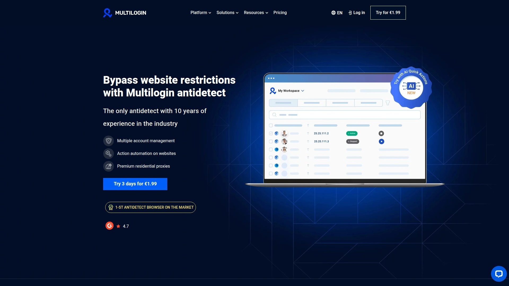
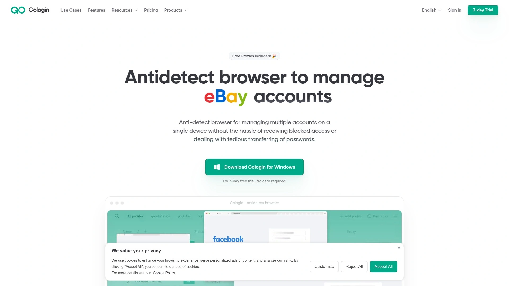
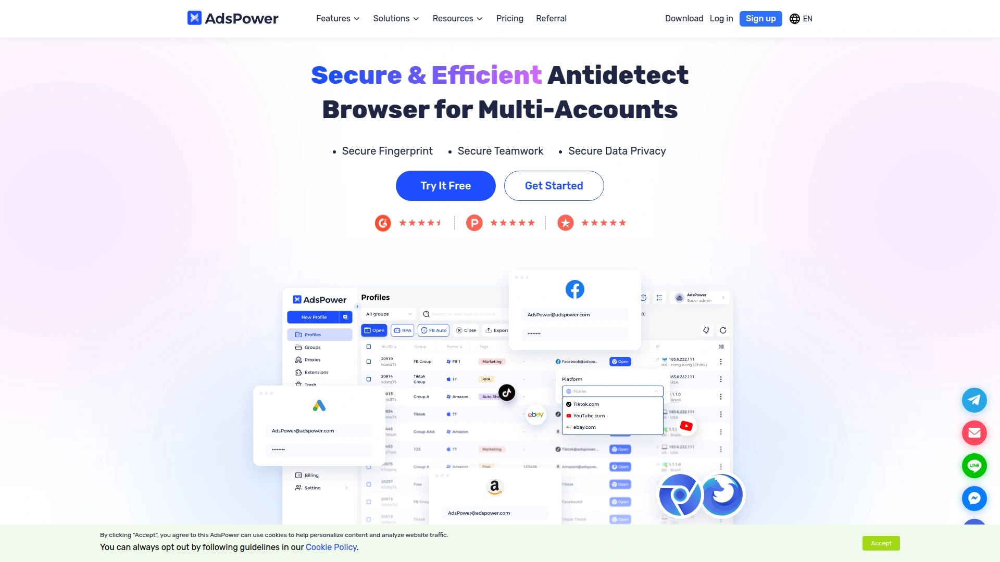
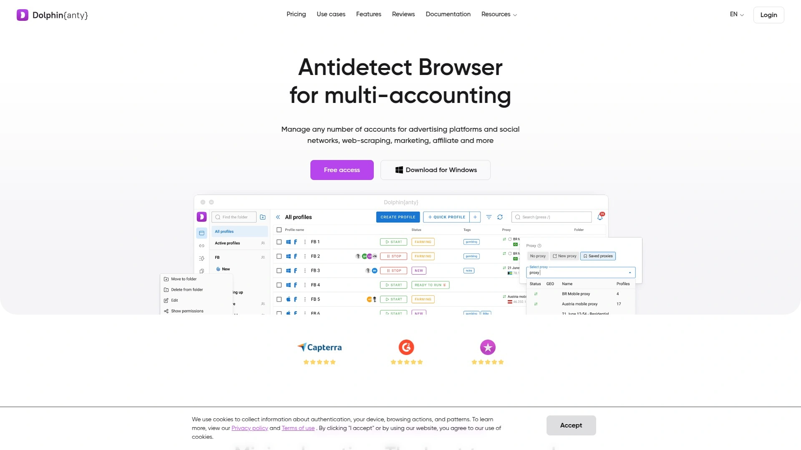
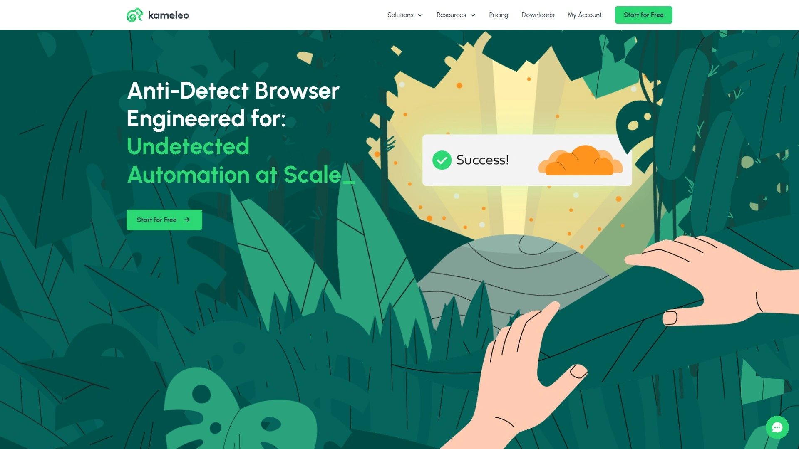
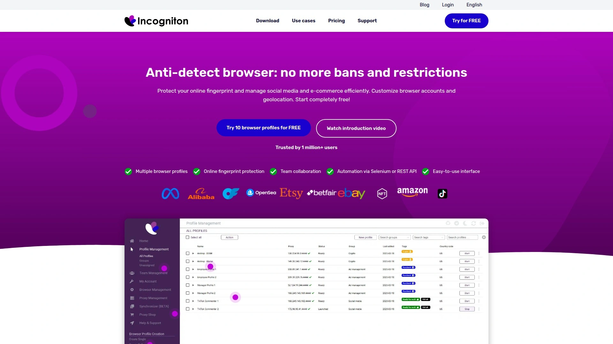
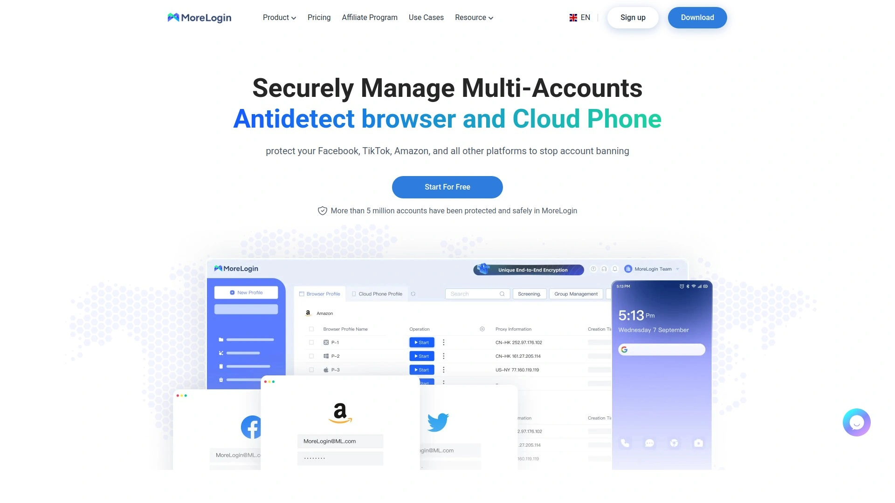
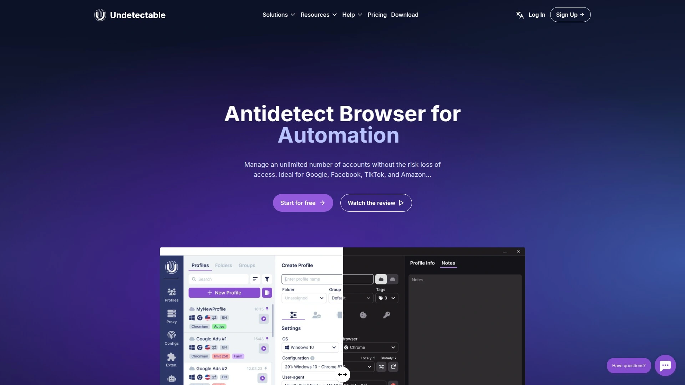
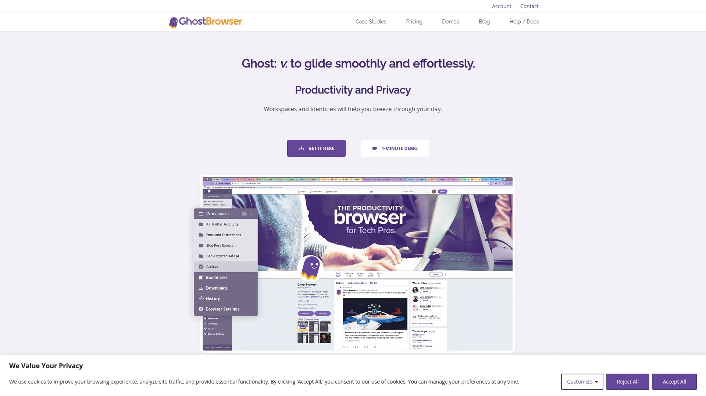

# 2025's Top 10 Best Anti-Detect Browser Tools

Managing five Facebook ad accounts from the same laptop feels like walking through a minefield—one wrong step and the platform flags all your accounts as suspicious, locks everything down, and leaves you scrambling to explain why your "unique users" all have identical digital fingerprints. Most multi-account managers waste hours setting up virtual machines or buying separate devices, burning money on hardware when the real problem is browser fingerprinting that tracks canvas data, WebGL parameters, fonts, timezone, and 50+ other signals that scream "same person, different accounts". Anti-detect browsers solve this by creating isolated browser profiles with completely unique digital fingerprints for each account, making every session look like a different device in a different location operated by a different person.

These specialized tools customize everything from your hardware specs and screen resolution to your WebRTC settings and audio context, fooling sophisticated tracking systems used by Facebook, Amazon, Google, TikTok, and other platforms that aggressively hunt multi-accounting [fetch_url:adspower]. Whether you're running e-commerce stores across multiple marketplaces, managing social media accounts for clients, handling ad campaigns, or scraping data at scale, the right anti-detect browser lets you operate dozens or hundreds of accounts safely from one computer without triggering bans. Below are 10 platforms ranked by fingerprint quality, ease of use, automation capabilities, and real-world detection resistance reported by users in 2025.

***

## **[Octo Browser](https://octobrowser.net)**

Top-tier fingerprint technology with built-in proxy marketplace and 99.995% uptime stability.

Octo Browser claims the #1 spot because it nails the fundamentals that matter most—rock-solid fingerprint spoofing, browser stability that doesn't crash during critical tasks, and customer support that actually knows what they're talking about. The platform creates high-quality digital fingerprints by customizing over 53 parameters including Canvas, WebGL, WebRTC, AudioContext, fonts, timezone, geolocation, and hardware characteristics. Websites see each profile as a completely different person on a different device in a different location.

What sets Octo Browser apart is the built-in proxy shop that lets you purchase residential and mobile proxies directly within the platform, eliminating the hassle of finding external providers. The advanced team management system includes flexible resource customization, letting you assign specific profiles and access levels to different team members. Octo Browser's Chromium kernel gets updated promptly every time Google releases a new Chrome version, ensuring your profiles blend seamlessly with millions of real Chrome users.

Security is layered at every level—accounts can be protected with two-factor authentication, and you can set additional passwords for particularly sensitive browser profiles. Octo Browser maintains an uptime of 99.995%, meaning the platform is reliably available when you need it. Profiles are stored in your account for 6 months, and there's no restriction on the number of devices—you can use different profiles simultaneously across multiple computers.

The platform supports Android device fingerprints, perfect for tasks like social media management that require mobile versions of websites. Octo Browser accepts payment via credit cards, crypto, and other methods listed on their pricing page. The customer service team is experienced, responds quickly to questions, explains details thoroughly to newcomers, and advises experts on advanced browser settings.

Octo Browser works best for serious multi-account operators—ad buyers, e-commerce sellers, social media managers, and agencies—who need enterprise-grade fingerprint protection, stable performance, and responsive support.

***

## **[Multilogin](https://multilogin.com)**

Enterprise-grade platform with built-in residential proxies and dual browser engines.

Multilogin has been the industry standard for over 10 years, offering the most sophisticated fingerprinting technology with 25+ configurable parameters tested daily on 50+ major platforms. The platform provides two browser engines—Mimic (Chromium-based) and Stealthfox (Firefox-based)—each updated every 2-4 weeks to stay ahead of detection methods. This dual-engine approach gives you flexibility depending on which websites you're working with.

The killer feature is built-in residential proxy access covering 150+ countries with 30+ million IPs and a 95% clean IP record. You don't need to hunt for external proxy providers or worry about mismatched fingerprints and IPs triggering bans—everything is integrated. Multilogin supports advanced automation through Selenium, Puppeteer, and Playwright with comprehensive REST API support delivering sub-200ms response times.

The platform handles 1,000+ concurrent profiles with cloud synchronization, and profile startup time averages just 3-5 seconds. Security features include AES-256 encryption, GDPR compliance, enterprise 2FA, and automatic deletion of inactive profiles after three months for data hygiene. Team collaboration tools include role-based access, encrypted storage, and audit logs.

Multilogin consistently scores 4.4-4.8 out of 5 across review platforms, with web scraping specialists reporting 90%+ success rates on sophisticated platforms when properly configured. The learning curve is moderate—beginners can use plug-and-play defaults while advanced users access powerful APIs.

Pricing starts at €99/month, positioning Multilogin as a premium solution. The platform works best for large agencies managing hundreds of profiles, professional traffic operations, and enterprise data collection requiring maximum reliability and built-in infrastructure.

***

## **[GoLogin](https://gologin.com)**

Affordable multi-platform browser with free proxies and mobile app support.

GoLogin has quickly gained traction since launch, amassing over 100,000 mobile app downloads with a 4.2-star average rating and managing 1.5 million accounts for 15,000+ customers [fetch_url:gologin]. The platform balances performance, ease of use, and pricing better than most competitors. GoLogin offers unlimited local browser profiles and limited cloud-based profiles, team collaboration features, and comprehensive fingerprint management.

The standout feature is free built-in proxies for both free and paid users—integrating IPs into your profiles is seamless thanks to the intuitive interface [fetch_url:gologin]. GoLogin automatically configures 53 fingerprint parameters including device specs, software version, and location without requiring manual tweaks [fetch_url:gologin]. Each account appears as a unique person to websites, and the platform uses AWS for data storage to ensure security and privacy [fetch_url:gologin].

GoLogin supports Windows, macOS, Linux, and Android, making it one of the few anti-detect browsers with a functional mobile app. The browser is essentially like a secured Chrome but 12 times cheaper and faster than running virtual machines [fetch_url:gologin]. GoLogin manages thousands of accounts, making it suitable for large-scale operations [fetch_url:gologin].

Customer support is rated #1 in the software category, available 24/7 including holidays [fetch_url:gologin]. The free plan includes 3 browser profiles with a 7-day trial of paid features. Paid plans start at $49/month for 100 profiles, with a 50% discount for annual payment. GoLogin works best for solo creators and small teams who want affordable, easy-to-use multi-accounting with included proxies.

***

## **[AdsPower](https://www.adspower.com)**

Feature-packed browser with RPA automation, dual engines, and no-code workflow builder.

AdsPower serves over 5 million users across 235 countries with a 4.8 TrustScore, making it one of the most widely adopted anti-detect browsers [fetch_url:adspower]. The platform creates unique browser fingerprints based on Windows, macOS, Android, and iOS with full customization over 20+ parameters including IP, language, resolution, timezone, cookies, geolocation, fonts, proxy, DNS, Canvas, WebGL, WebGPU, and IndexedDB [fetch_url:adspower].

AdsPower offers two browser engines—SunBrowser (Chromium-based) and FlowerBrowser (Firefox-based)—letting you choose based on your workflow preferences [fetch_url:adspower]. You can personalize SunBrowser with extensions from the Chrome Web Store or upload your own, and the platform ensures extension security by pulling from official libraries without automatic updates that could introduce vulnerabilities [fetch_url:adspower].

The Smart Simulator feature enables automation through RPA (Robotic Process Automation), API integration, and Synchronizer tools [fetch_url:adspower]. AdsPower provides ready-to-use automation templates or lets you customize your own tasks, simulating operations safely across multiple windows [fetch_url:adspower]. The no-code RPA is particularly beginner-friendly compared to competitors requiring Selenium or Puppeteer knowledge.

Security settings include precise profile permissions, failed login alerts, abnormal login interception, 2FA, action logs, and end-to-end encrypted transmission and storage [fetch_url:adspower]. AdsPower works with all popular proxy protocols (HTTP/HTTPS, Socks5, SSH) and IPv4/IPv6 addresses, seamlessly integrating with providers like Bright Data and Oxylabs [fetch_url:adspower].

The free trial allows 2 profiles to test functionality [fetch_url:adspower]. Pricing scales based on profiles and features, making it affordable for various team sizes. AdsPower is ideal for teams needing advanced automation, dual-engine flexibility, and strong security features without steep technical requirements [fetch_url:adspower].

***

## **[Dolphin Anty](https://anty.dolphin.ru.com)**

Sleek, beginner-friendly browser built specifically for ad traffic operations.

Dolphin Anty was created in 2021 by an experienced marketer who understood the exact pain points faced by people running ads on Facebook and other platforms. This focus shows in the design—the interface is sleek, lightweight, and faster than heavier competitors like AdsPower. Dolphin Anty offers strong fingerprint protection with 30+ customizable parameters, support for Puppeteer and Selenium automation, and both local and cloud storage.

The platform is particularly popular in the advertising community because it's specifically tailored for traffic operations. Users appreciate the simplicity and beginner-friendly UI that doesn't overwhelm with unnecessary complexity. Dolphin Anty handles basic team features, making it suitable for small groups collaborating on campaigns.

The free plan is generous, offering 10 free profiles compared to GoLogin's 3, giving new users more room to experiment. Paid plans start at $89/month for the Base plan with 100 profiles, plus $10 per additional team seat. While more expensive than GoLogin's $49/month starting price, Dolphin Anty offers a 20% discount for 6-month commitments.

The main limitation is that Dolphin Anty requires external proxies—there are no built-in options. This means extra costs and setup time finding quality proxy providers. Dolphin Anty works best for ad buyers and traffic operators who prioritize a lightweight, fast interface and don't mind sourcing proxies separately.

***

## **[Kameleo](https://kameleo.io)**

Developer-friendly browser with mobile fingerprinting and unlimited API requests.

Kameleo offers advanced browser fingerprint customization covering WebGL, audio, canvas, and more for high stealth levels. The platform emulates Android and iOS environments, making it ideal for managing accounts on mobile-first platforms like TikTok and Instagram. Kameleo's mobile fingerprinting from within the Windows app is a unique feature that competitors struggle to match.

What developers love is the fast, reliable API with no request rate limits, offering full freedom for custom automation workflows. Kameleo supports Selenium, Puppeteer, and Playwright with seamless integration, making it one of the most developer-friendly anti-detect browsers. The platform offers unlimited browser profile creation depending on your plan, with bulk creation and import/export tools for scaling.

Kameleo includes collaboration tools with workspace folders and role-based permissions for teams. Cloud synchronization is available on higher-tier plans, and profile isolation prevents cookie crossover or account linking. The built-in proxy checker and fingerprint randomizer simplify setup.

The downside is Kameleo only runs on Windows—Mac and Linux users can't use it at all. There are no built-in proxies, so you need to find, buy, and configure your own. The interface is more technical than beginner-focused browsers, requiring some expertise to use effectively.

Kameleo works best for automation-heavy users, developers building custom workflows, and operations requiring mobile device emulation.

***

## **[Incogniton](https://incogniton.com)**

User-friendly browser with standout cookie management and generous free plan.

Incogniton scores highly for intuitive user experience and ease of use. Everything from creating profiles to configuring fingerprint settings and automation tools is logically organized in the interface. The learning curve is minimal even for non-technical users new to anti-detect browsers.

Incogniton's standout feature is the Cookie Collector that enhances profile reliability by properly managing cookies across sessions. The platform includes collaboration tools, cross-platform compatibility, proxy management, and browser automation capabilities with synchronizers and Selenium integration. Incogniton offers more comprehensive features than many competitors, particularly in automation and cookie handling.

The free plan is extremely generous, offering 10 free browser profiles compared to MoreLogin's 2 profiles. This makes Incogniton one of the best options for testing anti-detect functionality before committing to paid plans. Getting started is straightforward—download from the official website, install for your OS (Windows or macOS), create an account, and start managing profiles.

Incogniton's clean, modern interface and beginner-friendly approach make it accessible to users who might be intimidated by more technical platforms. The platform works best for solo users wanting a simple, feature-rich introduction to anti-detect browsers with strong free-tier options.

***

## **[MoreLogin](https://morelogin.com)**

Budget-friendly platform with machine-learning fingerprints and bulk profile creation.

MoreLogin, headquartered in Hong Kong, uses machine-learning-driven browser fingerprinting technology and offers flexible pricing that scales with your needs. The platform covers core anti-detect functionality including profile management, collaboration tools, bulk profile creator, and synchronizers. MoreLogin provides a clean, modern user interface that's generally easy to navigate.

The bulk profile creator is particularly useful for operations that need to spin up dozens of accounts quickly. MoreLogin supports team collaboration, making it suitable for agencies and groups working together. The platform is more affordable than many competitors, with pricing designed for budget-conscious users.

However, MoreLogin has notable gaps compared to more established platforms—it lacks some of Incogniton's standout features like advanced automation, comprehensive cookie management, and built-in proxy solutions. Some users report that basic features like adding proxies to browser profiles can be difficult to find in the interface, making it less friendly for newcomers.

The free plan offers just 2 profiles, significantly less than competitors like Incogniton's 10 free profiles. The $9/month entry plan is affordable but limited. MoreLogin works best for budget scaling and users who need basic multi-accounting without advanced features.

***

## **[Undetectable](https://undetectable.io)**

Privacy-focused browser with active session lock and custom DNS protection.

Undetectable offers basic fingerprint customization with a focus on privacy and undetectability. Key features include active session lock that prevents profile access conflicts, integration with Google services, custom DNS for enhanced privacy, and port scan protection. The platform takes a security-first approach, ensuring profiles remain isolated and protected.

Undetectable provides profile management tools and supports automation through standard frameworks. The interface is straightforward, though not as polished as top-tier competitors. The platform works across Windows, macOS, and Linux.

Undetectable's fingerprint customization is less extensive than Multilogin's 25+ parameters or AdsPower's comprehensive settings. The platform is newer and less battle-tested than industry veterans, so detection resistance on highly sophisticated platforms remains a question mark.

Pricing details vary by plan, with options for individual users and small teams. Undetectable works best for privacy-conscious users who want solid basic fingerprint protection without needing the most advanced features.

***

## **[Ghost Browser](https://ghostbrowser.com)**

Session-based browser with multi-account management and independent cookie handling.

Ghost Browser allows users to create multiple sessions, each with its own set of cookies, fingerprints, and proxies. The platform focuses on session isolation rather than deep fingerprint customization, making it simpler but less stealthy than dedicated anti-detect browsers. Ghost Browser is suitable for users managing multiple accounts who don't face aggressive detection systems.

The interface is clean and straightforward, requiring minimal setup. Ghost Browser works well for basic multi-account needs like managing different social media profiles or testing websites with different logins. However, the fingerprint protection isn't as sophisticated as platforms like Multilogin or Octo Browser.

Ghost Browser is less expensive than enterprise-grade anti-detect browsers, making it accessible for casual users. The platform works best for simple multi-accounting tasks that don't involve high-stakes operations on platforms with advanced detection.

***

## FAQ

**How do anti-detect browsers differ from regular privacy browsers like Brave or Tor?**

Regular privacy browsers like Brave block tracking scripts and randomize some fingerprint parameters, but they don't create unique, customizable browser fingerprints for each profile. Anti-detect browsers like Octo Browser and Multilogin let you create dozens or hundreds of isolated profiles, each with completely different Canvas, WebGL, WebRTC, fonts, hardware specs, and geolocation settings that websites track. This makes every profile look like a different person on a different device, whereas Brave and Tor make everyone look similar, which platforms like Facebook can still detect.

**Do anti-detect browsers work on mobile devices for managing Instagram or TikTok accounts?**

Most anti-detect browsers run on desktop (Windows, macOS, Linux) but create mobile device fingerprints to simulate Android or iOS. Octo Browser supports Android device fingerprints perfect for social media management tasks. Kameleo emulates Android and iOS environments from within Windows, ideal for mobile-first platforms. GoLogin is one of the few with an actual Android app downloaded 100,000+ times [fetch_url:gologin]. For mobile account management, look for platforms explicitly mentioning mobile fingerprint support or mobile apps.

**Can websites detect that you're using an anti-detect browser?**

High-quality anti-detect browsers like Octo Browser and Multilogin are designed to pass detection tests on sophisticated platforms including Facebook, Amazon, Google, and TikTok. The key is proper configuration—mismatched proxies and fingerprints often trigger bans more than the browser itself. Multilogin reports 90%+ success rates on strict platforms when configured correctly. Lower-quality browsers with poor fingerprint spoofing can be detected. Testing your setup on sites like Pixelscan or BrowserLeaks before running actual accounts helps identify configuration issues.

***

## Conclusion

Running multiple accounts doesn't have to mean buying separate computers or constantly dodging platform bans. These anti-detect browsers create isolated digital identities with unique fingerprints that let you operate dozens or hundreds of accounts safely from one device, whether you're managing ad campaigns, running e-commerce stores, or handling social media at scale. The right platform depends on your budget, technical skill, automation needs, and whether you value built-in proxies over external integration.

For most serious multi-account operators who need enterprise-grade fingerprint protection, reliable uptime, built-in proxy options, and responsive expert support, **[Octo Browser](https://octobrowser.net)** delivers the best combination of stability, security, and advanced features that keep accounts safe across even the strictest platforms. Whether you're just starting with multi-accounting or scaling to hundreds of profiles, picking the right anti-detect browser means fewer bans, faster workflows, and more time focusing on what actually makes money.
